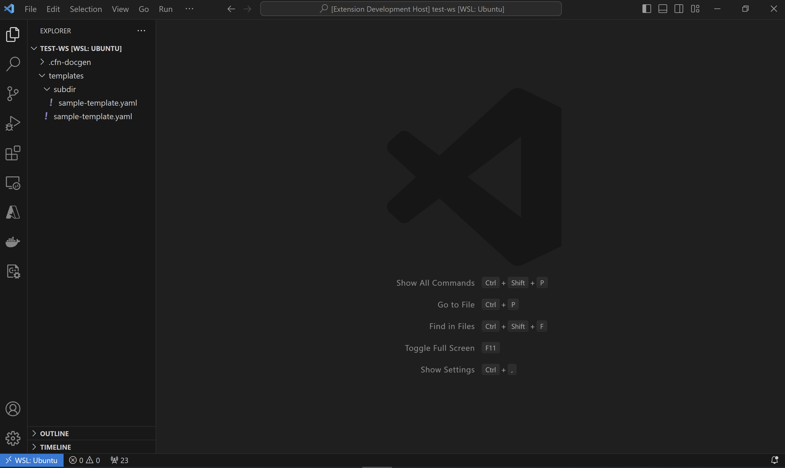
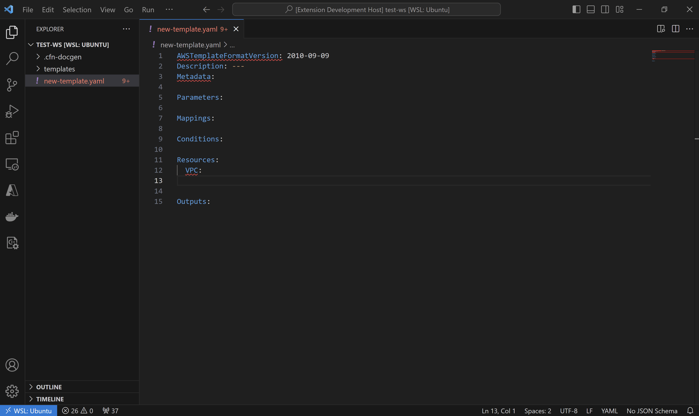

# cfn-docgen-vsc-extension README

cfn-docgen-vsc-extension invokes [cfn-docgen](https://github.com/horietakehiro/cfn-docgen) via visual studio code's interfaces, and makes it easier to generate and preview documents from cfn template files.

## Features

- invoke cfn-docgen command line tool via visual studio code's interfaces.
- make it easy to preview generated documents.
- generate resource definition skeleton for each resources

## Usage

### Generate a single document from a single cfn template

### Batch generate multiple documents from multiple cfn templates

### Generate skeleton for specified resources type

## Requirements

**This extension is just a wrapper for cfn-docgen. So you need to also install [cfn-docgen command line tool](https://github.com/horietakehiro/cfn-docgen#cli).**

## Extension Settings

This extension contributes the following settings:

* `cfn-docgen.OutputRootDirectory`: output root directory for generated documents
* `cfn-docgen.OpenPreview`: if true, automatically open markdown preview right after the document is generated
* `cfn-docgen.CustomResourceSpecificationPath`: absolute path for your custom resource specification json file
* `cfn-docgen.SkeletonFormat`: skeleton format
* `cfn-docgen.Debug`: if true, enable debug logging

## Known Issues

## Release Notes

